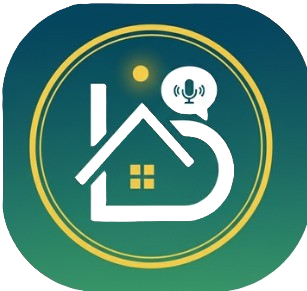
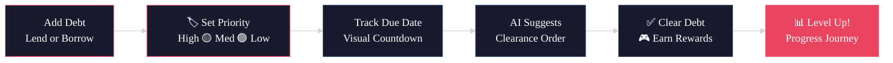
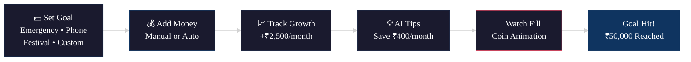
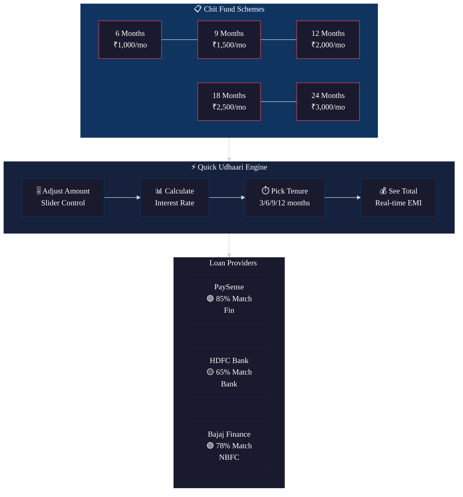
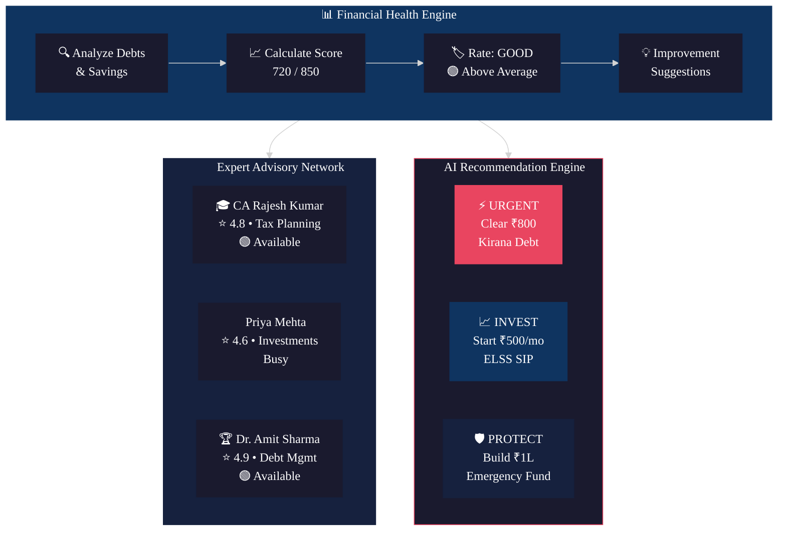
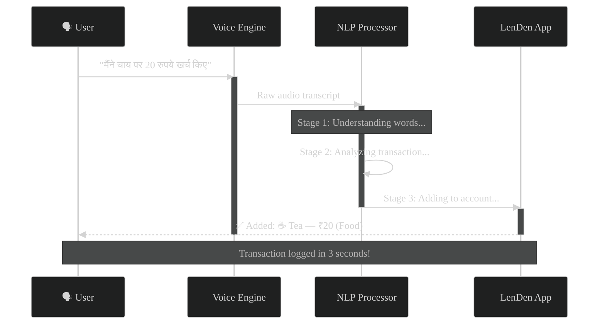
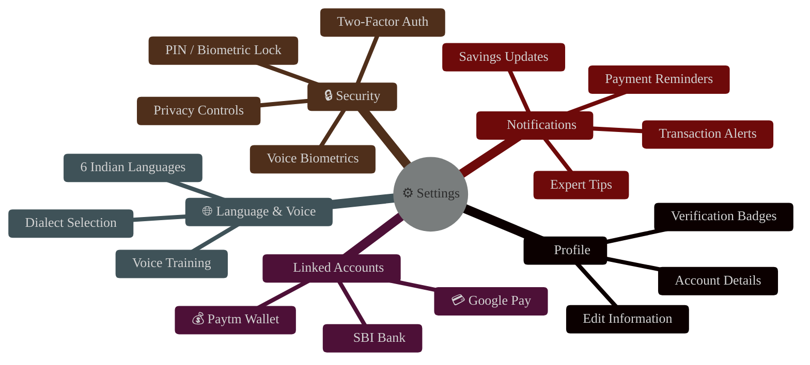
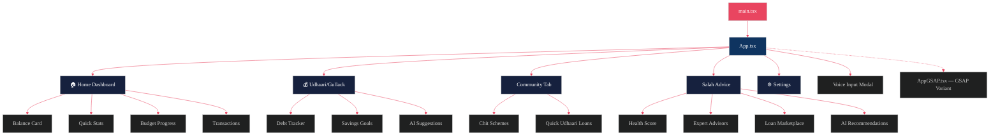

<div align="center">

<!-- Animated Header Banner -->


<!-- Animated Typing SVG — each line is short enough to never clip -->
<a href="https://git.io/typing-svg">
  
</a>

<br/>
<br/>

<!-- Project Logo -->


<br/>

<!-- Quick Badges -->
<p>
  
  
  
  
</p>

<p>
  <strong>A comprehensive fintech application empowering Indian users with intuitive debt tracking, smart savings, community investments, and AI-powered financial advice — all accessible through voice in multiple Indian languages.</strong>
</p>

<br/>

<!-- Quick Navigation -->
[Features](#-features) •
[Tech Stack](#-tech-stack) •
[Screenshots](#-application-gallery) •
[Getting Started](#-getting-started) •
[Architecture](#-architecture) •
[i18n](#-internationalization) •
[Contributors](#-contributors)

</div>

---

<!-- Animated Divider -->


## 📹 Prototype Demo

<div align="center">

[](public/prototype.mp4)

*Click above to watch LenDen in action — see the complete user flow from onboarding to financial management.*

</div>

---


## ✨ Features

```mermaid
%%{init: {'theme': 'dark', 'themeVariables': { 'primaryColor': '#e94560', 'primaryTextColor': '#ffffff', 'primaryBorderColor': '#0f3460', 'lineColor': '#16213e', 'secondaryColor': '#16213e', 'tertiaryColor': '#1a1a2e', 'fontFamily': 'Fira Code', 'fontSize': '14px'}}}%%
flowchart TB
    subgraph CORE["🏠 LenDen Ecosystem"]
        direction TB
        HOME["🏠 Smart Dashboard\n━━━━━━━━━━━━━\nBalance • Stats • Budget\nTransactions • Quick Actions"]
    end

    subgraph FINANCE["💎 Financial Modules"]
        direction LR
        UD["💰 Udhaari\n━━━━━━━━━━━\n• Debt Ledger\n• Priority Tracking\n• AI Clearance Tips\n• Gamification"]
        GU["🐷 Gullack\n━━━━━━━━━━━\n• Savings Overview\n• Goal Tracking\n• AI Saving Tips\n• Coin Animation"]
        CO["🤝 Community\n━━━━━━━━━━━\n• Chit Fund Schemes\n• Quick Udhaari\n• Multi-Provider\n• EMI Calculator"]
        SA["🧠 Salah\n━━━━━━━━━━━\n• Health Score\n• Expert Advisors\n• Loan Marketplace\n• AI Recommendations"]
    end

    subgraph INFRA["⚡ Infrastructure Layer"]
        direction LR
        VO["🎤 Voice Engine\nMultilingual NLP"]
        I18["🌐 i18n Layer\n6 Indian Languages"]
        AI["🤖 AI Engine\nSmart Suggestions"]
        SEC["🔒 Security\n2FA + Biometrics"]
    end

    CORE --> FINANCE
    FINANCE --> INFRA

    style CORE fill:#e94560,stroke:#e94560,color:#fff
    style FINANCE fill:#0f3460,stroke:#0f3460,color:#fff
    style INFRA fill:#16213e,stroke:#16213e,color:#fff
    style HOME fill:#1a1a2e,stroke:#e94560,color:#fff
    style UD fill:#1a1a2e,stroke:#e94560,color:#fff
    style GU fill:#1a1a2e,stroke:#e94560,color:#fff
    style CO fill:#1a1a2e,stroke:#e94560,color:#fff
    style SA fill:#1a1a2e,stroke:#e94560,color:#fff
    style VO fill:#1a1a2e,stroke:#16213e,color:#fff
    style I18 fill:#1a1a2e,stroke:#16213e,color:#fff
    style AI fill:#1a1a2e,stroke:#16213e,color:#fff
    style SEC fill:#1a1a2e,stroke:#16213e,color:#fff
```

<!-- Animated Feature Ecosystem Map -->
<div align="center">


<br/>



</div>


<!-- ═══════════════════════════════════════════════════ -->
<!-- 💰 UDHAARI MODULE -->
<!-- ═══════════════════════════════════════════════════ -->

<div align="center">
<table>
<tr>
<td align="center">

### 

</td>
</tr>
</table>
</div>

### 💰 Udhaari — Intelligent Debt Tracking

> *"Your personal debt ledger, reimagined with AI and gamification."*

<div align="center">



</div>

<table>
<tr>
<td width="50%">

#### 📊 Smart Ledger
Track every lending and borrowing transaction with **intelligent priority levels**:
- 🔴 **High Priority** — Due soon, affects local credit
- 🟡 **Medium Priority** — Standard timeline debts
- 🟢 **Low Priority** — Flexible repayment

#### 📅 Due Date Intelligence
Visual countdown indicators that change color as deadlines approach, with automated **push notifications** for upcoming payments.

</td>
<td width="50%">

#### 🤖 AI-Powered Clearance
The AI engine analyzes your debts and recommends the optimal clearance order:
> *"Clear your ₹800 debt with Local Kirana first — it's due soon and affects your local credit score!"*

#### 🎮 Gamification Engine
- 🏆 **Debt Clearing Journey** with progress visualization
- ⭐ **Level System** — Progress from Level 1 to Financial Freedom
- 🎯 **Milestones** — Celebrate each debt cleared with animations
- 📊 **40% Progress Bar** with coin-style indicators

</td>
</tr>
</table>


<!-- ═══════════════════════════════════════════════════ -->
<!-- 🐷 GULLACK MODULE -->
<!-- ═══════════════════════════════════════════════════ -->

<div align="center">
<table>
<tr>
<td align="center">

### 

</td>
</tr>
</table>
</div>

### 🐷 Gullack — Smart Savings Management

> *"Watch your digital piggy bank grow coin by coin, guided by AI."*

<div align="center">



</div>

<table>
<tr>
<td width="50%">

#### 💸 Total Savings Dashboard
Real-time overview showing **₹30,700 saved** with:
- 📈 Monthly growth tracking (**+₹2,500** trend)
- 🎯 Goal-wise breakdown with deadlines
- 📊 Visual progress bars per goal

#### 🎯 Active Savings Goals
```
🛡️ Emergency Fund    ₹15,000 / ₹50,000  ▓▓▓▓▓▓░░░░░░░ 30%
📱 New Phone         ₹8,500  / ₹25,000  ▓▓▓▓░░░░░░░░░ 34%
🎊 Festival Shopping ₹7,200  / ₹10,000  ▓▓▓▓▓▓▓▓▓░░░░ 72%
```

</td>
<td width="50%">

#### 💡 AI Saving Tips
Personalized suggestions that actually save money:
> *"Buy a monthly bus pass for ₹800 instead of daily tickets. You'll save ₹400 every month!"*

#### 🐷 Animated Piggy Bank
A delightful visual experience as your savings grow:
```
🐷 Your Gullack is Growing!
🪙🪙🪙🪙🪙🪙⚪⚪⚪⚪  60% Full
Keep saving to see it fill up with coins!
```
Each coin lights up golden as you hit **10% milestones**, creating a satisfying sense of progress.

</td>
</tr>
</table>


<!-- ═══════════════════════════════════════════════════ -->
<!-- 🤝 COMMUNITY MODULE -->
<!-- ═══════════════════════════════════════════════════ -->

<div align="center">
<table>
<tr>
<td align="center">

### 

</td>
</tr>
</table>
</div>

### 🤝 Community — Chit Funds & Quick Loans

> *"Collective financial power, digitized and made transparent for everyone."*

<div align="center">



</div>

<table>
<tr>
<td width="50%">

#### 📋 Chit Fund Schemes
Choose from **5 investment cycles** tailored to Indian community finance:

| Scheme | Monthly | Total | Duration |
|--------|---------|-------|----------|
| 🥉 Starter | ₹1,000 | ₹6,000 | 6 months |
| 🥈 Standard | ₹1,500 | ₹13,500 | 9 months |
| 🥇 Premium | ₹2,000 | ₹24,000 | 12 months |
| 💎 Gold | ₹2,500 | ₹45,000 | 18 months |
| 👑 Diamond | ₹3,000 | ₹72,000 | 24 months |

Each scheme includes detailed **benefits, rules, eligibility**, and interactive modals.

</td>
<td width="50%">

#### ⚡ Quick Udhaari (Instant Loans)
Micro-loan engine with real-time calculations:
- 🎚️ **Adjustable Slider** — Drag to set loan amount
- 📊 **Live Interest** — Rates computed instantly
- ⏱️ **Flexible Tenure** — 3, 6, 9, or 12 months
- 🧮 **Total Preview** — See exact repayment amount

#### 🏦 Multi-Provider Marketplace
| Provider | Type | Max Loan | Interest | Speed |
|----------|------|----------|----------|-------|
| PaySense | Fintech | ₹5L | 16-36% | 24hrs |
| HDFC | Bank | ₹40L | 10.5-21% | 3-7d |
| Bajaj | NBFC | ₹25L | 13-30% | 2-4hrs |

</td>
</tr>
</table>


<!-- ═══════════════════════════════════════════════════ -->
<!-- 🧠 SALAH MODULE -->
<!-- ═══════════════════════════════════════════════════ -->

<div align="center">
<table>
<tr>
<td align="center">

### 

</td>
</tr>
</table>
</div>

### 🧠 Salah — Expert Financial Advice & AI Recommendations

> *"Certified experts and AI intelligence, both at your fingertips."*

<div align="center">



</div>

<table>
<tr>
<td width="50%">

#### 📊 Financial Health Score
Your credit-worthiness at a glance:
```
Score: 720 / 850          Rating: 🟢 GOOD
████████████████████░░░░   84.7%

💡 Keep clearing debts to reach 750+
   for better loan rates!
```

#### 👨‍💼 Expert Advisory Network
Connect with **certified financial professionals**:
- 🎓 **Chartered Accountants** — Tax planning experts
- 💼 **Financial Advisors** — Investment strategists
- 🏆 **Debt Specialists** — Debt management pros
- 💬 **Chat** or 📞 **Call** — Instant consultation
- ⭐ **Ratings** + years of experience per advisor

</td>
<td width="50%">

#### 🤖 AI Recommendation Tiers

> **⚡ IMMEDIATE ACTION**
> *Clear your high-priority ₹800 debt with Local Kirana to improve local credit standing*

> **📈 INVESTMENT TIP**
> *Start a SIP of ₹500/month in ELSS funds for tax savings and long-term growth*

> **🛡️ GOAL PLANNING**
> *Create a dedicated emergency fund goal of ₹1 lakh for better financial security*

#### 🏦 Loan Details Modal
One-click deep dive into any loan provider:
- 📊 Eligibility score with match percentage
- 💹 Interest rate breakdown
- ⏱️ Processing time estimates
- ✅ Feature comparison badges
- 🔗 Direct apply on provider website

</td>
</tr>
</table>


<!-- ═══════════════════════════════════════════════════ -->
<!-- 🎤 VOICE ENGINE MODULE -->
<!-- ═══════════════════════════════════════════════════ -->

<div align="center">
<table>
<tr>
<td align="center">

### 

</td>
</tr>
</table>
</div>

### 🎤 Voice-First Financial Input

> *"Speak naturally in your mother tongue — LenDen understands."*

<div align="center">



</div>

<table>
<tr>
<td width="50%">

#### 🗣️ Multilingual Voice Commands
Speak naturally in **Hindi, English,** or any supported language:

```
🗣️ "मैंने चाय पर 20 रुपये खर्च किए"
   → ☕ Tea Expense • ₹20 • Food

🗣️ "I spent 50 rupees on auto rickshaw"
   → 🛺 Auto Rickshaw • ₹50 • Transport

🗣️ "ऑटो में 45 रुपये दिए"
   → 🛺 Auto Rickshaw • ₹45 • Transport

🗣️ "Add 500 rupees grocery expense"
   → 🛒 Grocery • ₹500 • Food

🗣️ "राहुल को 200 रुपये उधार दिए"
   → 💰 Lent to Rahul • ₹200 • Udhaari

🗣️ "Received 15000 salary"
   → 💵 Salary Credit • ₹15,000 • Income
```

</td>
<td width="50%">

#### 🧠 3-Stage NLP Processing Pipeline
```
🔵 Stage 1 ━━━━━━━━━━━━━━━━━━ Understanding
   Speech-to-text in detected language

🟡 Stage 2 ━━━━━━━━━━━━━━━━━━ Analyzing
   Extract: Amount • Category • Type

🟢 Stage 3 ━━━━━━━━━━━━━━━━━━ Recording
   Auto-create transaction entry
```

#### 🔊 Voice Biometrics Security
- 🎤 **Voice Recognition Training** — Unique voiceprint
- 🔒 **Secure Authentication** — Unlock with your voice
- 🛡️ **Anti-Spoofing** — Liveness detection built-in

#### 💡 Smart Suggestion Chips
Pre-built voice command templates appear as tappable chips, making it easy for first-time users.

</td>
</tr>
</table>


<!-- ═══════════════════════════════════════════════════ -->
<!-- ⚙️ SETTINGS MODULE -->
<!-- ═══════════════════════════════════════════════════ -->

<div align="center">
<table>
<tr>
<td align="center">

### 

</td>
</tr>
</table>
</div>

### ⚙️ Settings & Security Hub

<div align="center">



</div>

---


## 🛠 Tech Stack

<div align="center">

### Frontend Core
[](https://reactjs.org/)
[](https://www.typescriptlang.org/)
[](https://vitejs.dev/)

### Styling & UI
[](https://tailwindcss.com/)
[](https://ui.shadcn.com/)
[](https://www.radix-ui.com/)
[](https://lucide.dev/)

### Animation & Motion
[](https://greensock.com/gsap/)
[](https://www.framer.com/motion/)

### Data & Forms
[](https://recharts.org/)
[](https://react-hook-form.com/)
[](https://zod.dev/)

### Internationalization
[](https://www.i18next.com/)
[](https://react.i18next.com/)

### Routing
[](https://reactrouter.com/)

### Backend
[](https://nodejs.org/)
[](https://expressjs.com/)
[](https://www.postgresql.org/)

### AI & APIs
[](https://ai.google.dev/)
[](https://developer.mozilla.org/en-US/docs/Web/API/Web_Speech_API)
[](https://razorpay.com/)

### DevOps
[](https://github.com/features/actions)

</div>

<details>
<summary>📦 <strong>Full Dependency Tree (click to expand)</strong></summary>

<br/>

| Category | Package | Version |
|----------|---------|---------|
| **Core** | `react` | ^18.3.1 |
| | `react-dom` | ^18.3.1 |
| | `react-router-dom` | ^7.9.3 |
| **UI Library** | `@radix-ui/*` | Various (20+ primitives) |
| | `class-variance-authority` | ^0.7.1 |
| | `clsx` + `tailwind-merge` | Latest |
| | `cmdk` | ^1.1.1 |
| **Animation** | `gsap` | ^3.13.0 |
| | `framer-motion` | ^12.23.22 |
| **Charts** | `recharts` | ^2.15.2 |
| **Forms** | `react-hook-form` | ^7.64.0 |
| | `@hookform/resolvers` | ^5.2.2 |
| | `zod` | ^4.1.11 |
| **i18n** | `i18next` | ^25.5.3 |
| | `react-i18next` | ^16.0.0 |
| **Other** | `embla-carousel-react` | ^8.6.0 |
| | `input-otp` | ^1.4.2 |
| | `react-day-picker` | ^8.10.1 |
| | `react-resizable-panels` | ^2.1.7 |
| | `sonner` | ^2.0.3 |
| | `vaul` | ^1.1.2 |
| **Build** | `vite` | 6.3.5 |
| | `@vitejs/plugin-react-swc` | ^3.10.2 |

</details>

---


## 🖼 Application Gallery

<div align="center">

| | | |
|:---:|:---:|:---:|
| <br/>**🏠 Dashboard** | <br/>**💰 Udhaari & Gullack** | <br/>**🏦 Community Chit Funds** |
| <br/>**🧠 Salah (Advice)** | <br/>**👤 User Profile** | <br/>**🏷️ Brand Identity** |

</div>

---


## 🚀 Getting Started

### Prerequisites

<table>
<tr>
<td>

```
✅ Node.js ≥ 16
✅ npm or yarn
✅ Git
```

</td>
</tr>
</table>

### Installation

```bash
# Clone the repository
git clone https://github.com/your-username/LenDen.git

# Navigate to the project directory
cd LenDen

# Install dependencies
npm install
```

### Development

```bash
# Start development server
npm run dev
```

> 🌐 The app will be available at **`http://localhost:3000`** (configured in `vite.config.ts`)

### Production Build

```bash
# Create optimized production build
npm run build
```

> 📁 Build output is generated in the `build/` directory

---


## 🏗 Architecture

```
LenDen/
├── 📄 index.html                    # Entry point
├── 📦 package.json                  # Dependencies & scripts
├── ⚙️ vite.config.ts                # Vite build config + aliases
│
├── 📂 src/
│   ├── 🚀 main.tsx                  # App bootstrap
│   ├── 📱 App.tsx                   # Main app (1490 lines, all pages)
│   ├── 🎬 AppGSAP.tsx              # GSAP-animated variant with i18n
│   ├── 🌐 i18n.ts                  # i18next configuration
│   ├── 🎨 index.css                # Global styles + Tailwind
│   │
│   ├── 📂 components/
│   │   ├── 📊 ModernDashboard.tsx   # Financial overview dashboard
│   │   ├── 💰 ModernUdhaariGullack.tsx  # Debt & savings manager
│   │   ├── 🤝 CommunityTab.tsx     # Chit funds & quick loans
│   │   ├── 🧠 ModernSalah.tsx      # Expert advice & loan marketplace
│   │   ├── ⚙️ ModernSettings.tsx    # Settings with linked accounts
│   │   ├── 🎤 ModernVoiceInput.tsx  # Voice transaction input
│   │   ├── 🎓 Onboarding.tsx       # New user onboarding flow
│   │   ├── 👑 ModernPremium.tsx     # Premium features module
│   │   ├── 📐 ModernLayout.tsx      # Responsive app layout
│   │   │
│   │   └── 📂 ui/                   # 49 shadcn/ui components
│   │       ├── button.tsx, card.tsx, dialog.tsx ...
│   │       ├── tabs.tsx, badge.tsx, progress.tsx ...
│   │       └── chart.tsx, carousel.tsx, sidebar.tsx ...
│   │
│   ├── 📂 locales/                  # Translation files
│   │   ├── 🇬🇧 en.json
│   │   └── 🇮🇳 hi.json (+ te, ta, mr, sd)
│   │
│   ├── 📂 styles/                   # Additional stylesheets
│   ├── 📂 mockups/                  # Design mockups
│   └── 📂 guidelines/              # Design guidelines
│
└── 📂 public/                       # Static assets
    ├── 🖼️ homepage.jpg, profile.jpg, etc.
    ├── 📹 prototype.mp4
    └── 🎨 logo.jpg, pfp.png
```

### Component Architecture



---


## 🌐 Internationalization

LenDen is built for **India's linguistic diversity** with full i18n support:

<div align="center">

| Language | Flag | Code | Status |
|----------|:----:|:----:|:------:|
| English | 🇬🇧 | `en` | ✅ Complete |
| Hindi (हिंदी) | 🇮🇳 | `hi` | ✅ Complete |
| Telugu (తెలుగు) | 🇮🇳 | `te` | 🔄 In Progress |
| Tamil (தமிழ்) | 🇮🇳 | `ta` | 🔄 In Progress |
| Marathi (मराठी) | 🇮🇳 | `mr` | 🔄 In Progress |
| Sindhi (سنڌي) | 🇮🇳 | `sd` | 🔄 In Progress |

</div>

> 📁 Translation files located in `src/locales/` • Powered by **react-i18next**

---


## 🎨 Design Philosophy

<div align="center">

| Principle | Implementation |
|-----------|---------------|
| 🎯 **Mobile-First** | Optimized for smartphones with `max-w-md` responsive layout |
| 🎨 **Gradient-Rich UI** | Layered gradients with glassmorphism effects throughout |
| ✨ **Micro-Animations** | GSAP scroll triggers + Framer Motion page transitions |
| ♿ **Accessibility** | Voice-first design for users with limited literacy |
| 🧩 **Component System** | 49 shadcn/ui primitives for consistent design language |
| 🇮🇳 **Culturally Aware** | Indian financial terminology (Udhaari, Gullack, Salah) |

</div>

---

## 📚 Resources

<div align="center">

[](https://github.com/your-repo/docs)
[](https://api.leinden.com)
[](https://forum.leinden.com)
[](https://support.leinden.com)

</div>

---


## 👥 Contributors

<div align="center">


<br/>
<br/>

|  |  |  |  |
|:---:|:---:|:---:|:---:|
| **Aaditya Jaiswar** | **Samyak Dandge** | **Shreyash Mane** | **Rutuja Katagi** |
| Core Architecture & Components | Design System & UX | Testing & QA | Documentation & Guides |
| [](https://www.github.com/aad1tyaaaaa) [](https://www.linkedin.com/in/aadityaaaaa) | [](https://github.com/janesmith) [](https://linkedin.com/in/janesmith) | [](https://github.com/bobjohnson) [](https://linkedin.com/in/bobjohnson) | [](https://github.com/alicebrown) [](https://linkedin.com/in/alicebrown) |

</div>

---

## 📄 License

<div align="center">

This project is licensed under the **MIT License** — see the [LICENSE](LICENSE) file for details.

<br/>

```
MIT License • Copyright (c) 2025 Aaditya Jaiswar
```

</div>

---

<div align="center">

<!-- Animated Star Badge -->
<a href="https://github.com/your-username/LenDen">
  
</a>
<a href="https://github.com/your-username/LenDen/fork">
  
</a>
<a href="https://github.com/your-username/LenDen/issues">
  
</a>

<br/>
<br/>


<sub>Built with 💖 by the LenDen Team | Making financial management accessible for every Indian</sub>

</div>
