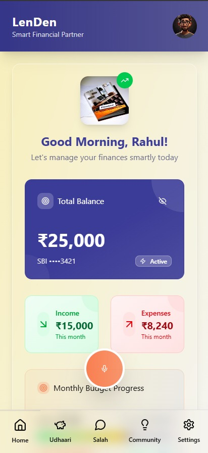
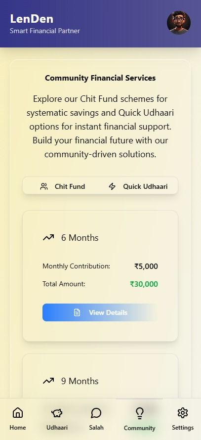
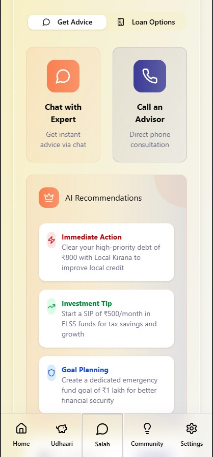
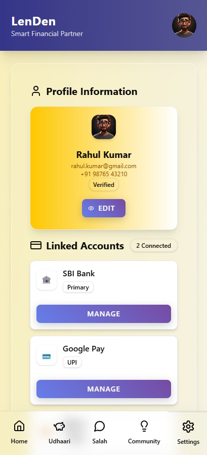
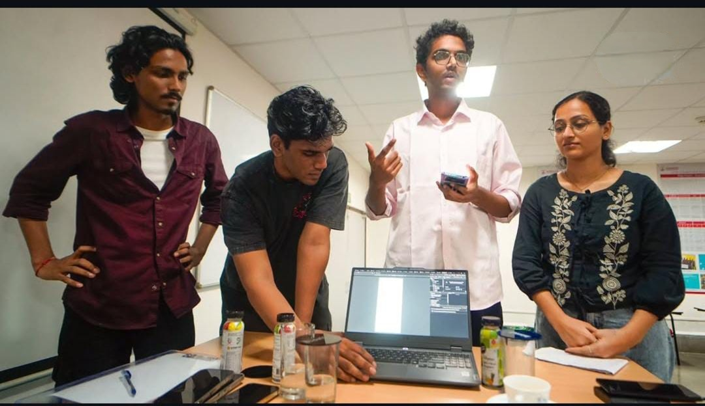

#  LenDen

[](https://reactjs.org/)
[](https://nextjs.org/)
[](https://www.typescriptlang.org/)
[](https://tailwindcss.com/)
[](https://vitejs.dev/)
[](https://ui.shadcn.com/)
[](https://greensock.com/gsap/)
[](https://www.i18next.com/)
[](https://firebase.google.com/)
[](https://render.com/)
[](https://nodejs.org/)
[](https://expressjs.com/)
[](https://www.mongodb.com/)
[](https://redux.js.org/)
[](https://jestjs.io/)
[](https://www.cypress.io/)
[](https://www.docker.com/)
[](https://aws.amazon.com/)
[](https://git-scm.com/)
[](https://github.com/features/actions)

A comprehensive financial management application designed to empower users with tools for debt tracking, savings management, community investments, and expert financial advice. Built with a modular architecture to ensure scalability and maintainability.

## 📹 Prototype Video

Check out the prototype video to see the application in action:

[](public/prototype.mp4)

*Click the badge above to watch the prototype video demonstration of LeinDen in action.*

## 🖼️ Application Gallery

Discover the core functionalities of LeinDen through our curated application previews:

| Feature | Preview |
|---------|---------|
| 🏠 **Homepage** |  |
| 💰 **Udhaari and Gullack** |  |
| 🏦 **Chit Fund** |  |
| 💡 **Advice** |  |
| 👤 **Profile** |  |
| 🏷️ **Logo** |  |

## 🚀 Getting Started

### Prerequisites
- Node.js (version 16 or higher)
- npm or yarn

### Installation
```bash
npm install
```

### Running the Application
```bash
npm run dev
```

The application will be available at `http://localhost:5173` (default Vite port).

## ✨ Features

### 💰 UdhaariGullack Component
A comprehensive financial management module that helps users track and manage their lending and savings activities:

- **Udhaari Tab**: Manages debt tracking with features like:
  - 📊 Lending and borrowing records with priority levels (high, medium, low)
  - 📅 Due date tracking and visual indicators
  - 🤖 AI-powered suggestions for debt clearance (e.g., prioritizing high-priority debts)
  - 🎮 Gamification elements like debt clearing progress bars and visual rewards

- **Community Tab**: Placeholder for community-related features and interactions

- **Gullack Tab**: Savings management with:
  - 💸 Total savings overview with monthly growth tracking
  - 🎯 Savings goals tracking with progress bars and target deadlines
  - 💡 AI saving tips (e.g., cost-saving suggestions like using monthly bus passes)
  - 🐷 Visual savings accumulation animation

### ⚙️ Settings Component
A comprehensive user settings and account management interface:

- **👤 Profile Information**: User profile editing with verification badges and account details
- **🔗 Linked Accounts**: Integration with multiple financial accounts including:
  - 🏦 Bank accounts (SBI, etc.)
  - 💳 UPI wallets (Google Pay)
  - 💰 Digital wallets (Paytm)
  - 🔄 Account management and connection status
- **🌐 Language & Voice Settings**: Multi-language support with options for:
  - 🇮🇳 Hindi, English, Telugu, Tamil, Marathi, Sindhi
  - 🎤 Voice recognition training for enhanced accessibility
- **🔒 Security & Privacy**: Advanced security features including:
  - 🛡️ Two-factor authentication (2FA) management
  - 🔊 Voice biometrics for secure authentication
  - 📱 App lock with PIN or biometric options
  - 📋 Privacy policy and data permissions
- **🔔 Notifications**: Customizable notification preferences for:
  - 💸 Transaction alerts
  - ⏰ Payment reminders
  - 🎯 Savings goal updates
  - 💡 Expert financial advice tips

### 📊 ModernDashboard Component
The main financial overview dashboard providing users with a comprehensive view of their finances:

- **👁️ Balance Display**: Secure balance viewing with show/hide functionality
- **📈 Quick Stats**: Monthly income and expense summaries with visual indicators
- **🎯 Budget Progress**: Budget tracking with progress bars and remaining amount calculations
- **📝 Recent Transactions**: Transaction history with categorization and date tracking
- **⚡ Quick Actions**: Direct access to add transactions and set financial goals

### 👥 CommunityTab Component
Community-driven financial services and collective investment options:

- **🤝 Chit Fund Schemes**: Various investment schemes with different durations:
  - 📅 6, 9, 12, 18, and 24-month schemes
  - 💵 Monthly contribution tracking and total amount calculations
  - 📋 Detailed scheme information including benefits, rules, and eligibility criteria
  - 📖 Interactive modals with comprehensive scheme details
- **⚡ Quick Udhaari**: Instant loan options with:
  - 🎚️ Adjustable loan amounts via sliders
  - 💰 Interest rate calculations based on amount and repayment period
  - ⏱️ Repayment period options (3, 6, 9, 12 months)
  - 🧮 Real-time total amount calculations including interest

### 🧠 ModernSalah Component
Expert financial advice and loan marketplace:

- **📊 Financial Health Score**: Credit score display with progress tracking and improvement suggestions
- **👨‍💼 Expert Advisors**: Directory of certified financial advisors including:
  - 🎓 Chartered Accountants (CA)
  - 💼 Financial Advisors
  - 📉 Debt Management Experts
  - ⭐ Rating, experience, and specialization details
  - 🟢 Availability status and pricing per minute
- **🏦 Loan Options**: Comprehensive loan marketplace with:
  - 🏛️ Multiple providers (Banks, NBFCs, Fintech companies)
  - 📈 Eligibility scoring and match percentages
  - 💹 Interest rates, processing times, and maximum amounts
  - 🔍 Feature comparisons and application options
- **🤖 AI Recommendations**: Intelligent financial advice including:
  - ⚡ Immediate action items for debt management
  - 📈 Investment tips and goal planning suggestions
  - 🛡️ Personalized financial security recommendations

## 🌐 Internationalization Support
The application supports multiple Indian languages through internationalization (i18n):
- 🇬🇧 English
- 🇮🇳 Hindi (हिंदी)
- 🇮🇳 Telugu (తెలుగు)
- 🇮🇳 Tamil (தமிழ்)
- 🇮🇳 Marathi (मराठी)
- 🇮🇳 Sindhi (سنڌي)

Language files are located in `src/locales/` with translation keys for comprehensive localization.

## 🏗️ Modular Design Approach
The project follows a modular architecture with:
- 🧩 Reusable UI components in `src/components/ui/`
- 📁 Feature-based component organization
- 🔧 Separation of concerns with dedicated modules for different functionalities
- 🎨 Consistent design system with shadcn/ui components
- 📱 Responsive design for mobile and desktop experiences

## 🛠️ Technology Stack
- **⚛️ Frontend**: React with TypeScript
- **🎨 Styling**: Tailwind CSS with custom gradients and animations
- **🧩 UI Components**: shadcn/ui component library
- **🌐 Internationalization**: react-i18next
- **⚡ Build Tool**: Vite
- **🎯 Icons**: Lucide React
- **🎭 Animations**: Framer Motion (in CommunityTab)

## 📚 Resources

- [📖 Documentation](https://github.com/your-repo/docs)
- [🎯 API Reference](https://api.leinden.com)
- [💬 Community Forum](https://forum.leinden.com)
- [🆘 Support Center](https://support.leinden.com)

## 👥 Contributors

We'd like to thank the following contributors for their valuable contributions to LenDen:



| Contributor | Role | Contributions | GitHub | LinkedIn |
|-------------|------|---------------|--------|----------|
| 👨‍💻 **Aaditya Jaiswar** | Lead Developer | Core architecture, React components | [GitHub](www.github.com/aad1tyaaaaa) | [LinkedIn](www.linkedin.com/in/aadityaaaaa) |
| 👩‍🎨 **Samyak Dandge** | UI/UX Designer | Design system, user experience | [GitHub](https://github.com/janesmith) | [LinkedIn](https://linkedin.com/in/janesmith) |
| 🧪 **Shreyash Mane** | QA Engineer | Testing, quality assurance | [GitHub](https://github.com/bobjohnson) | [LinkedIn](https://linkedin.com/in/bobjohnson) |
| 📚 **Rutuja Katagi** | Technical Writer | Documentation, user guides | [GitHub](https://github.com/alicebrown) | [LinkedIn](https://linkedin.com/in/alicebrown) |
  
